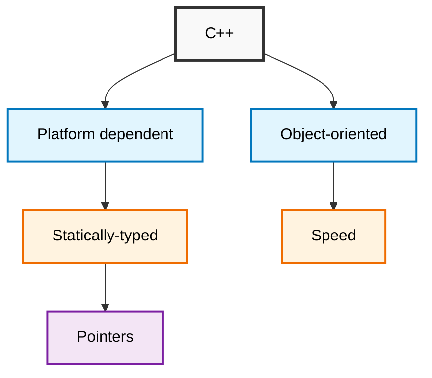
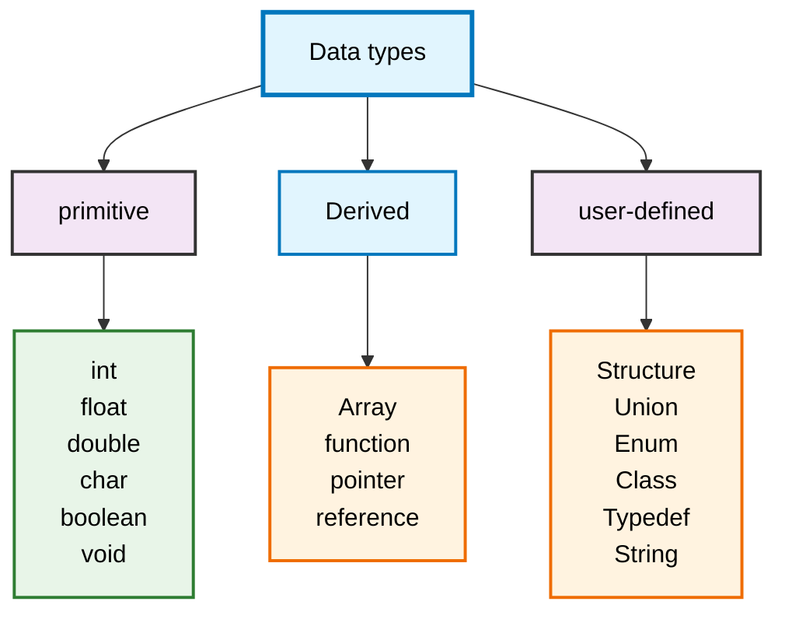

# C++ Guide

### Key Features Explained

- Platform dependent: C++ code needs to be compiled for specific platforms/architectures
- Object-oriented: Supports classes, objects, inheritance, polymorphism, and encapsulation
- Statically-typed: Variable types are checked at compile time
- Speed: Compiled language that produces efficient machine code
- Pointers: Direct memory access and manipulation capabilities
## #include -> Preprocessor directives
## How to use namespace
- Method 1
```cpp
#include <iostream>

using namespace std;

int main () {
  cout << "siddharth";
}
```
- Method 2
```cpp
#include <iostream>

int main () {
  std::cout << "siddharth" << std::endl;
}
```
- Method 3
```cpp
#include <iostream>

using std::cout;
using std::endl;

int main () {
  std::cout << "siddharth" << std::endl;
}
```
### Variable
```cpp
const int uuid = 756984;

uuid = 44587; // error; ❌
```
## C++ Data Types
##### This diagram shows the classification of data types in C++.


