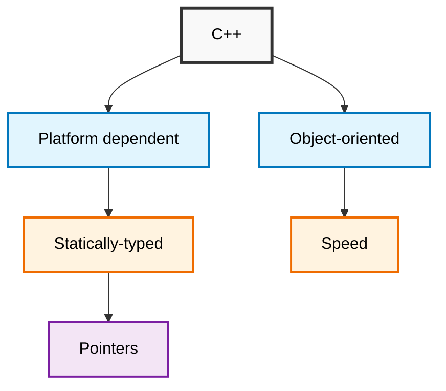

# C++ Guide


- #include -> Preprocessor directives
## How to use namespace
- Method 1
```cpp
#include <iostream>

using namespace std;

int main () {
  cout << "siddharth";
}
```
- Method 2
```cpp
#include <iostream>

int main () {
  std::cout << "siddharth" << std::endl;
}
```
- Method 3
```cpp
#include <iostream>

using std::cout;
using std::endl;

int main () {
  std::cout << "siddharth" << std::endl;
}
```
### Variable
```cpp
const int uuid = 756984;

uuid = 44587; // error; ❌
```
