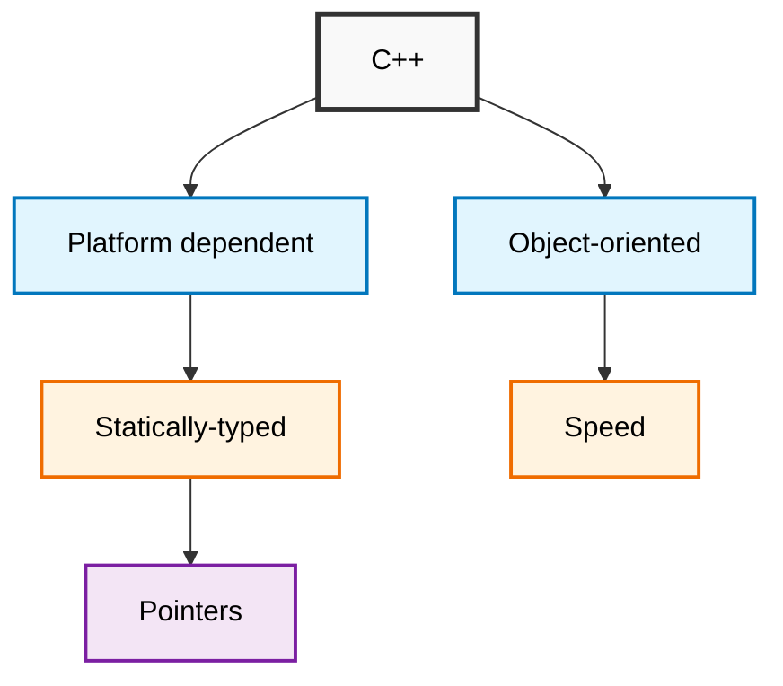
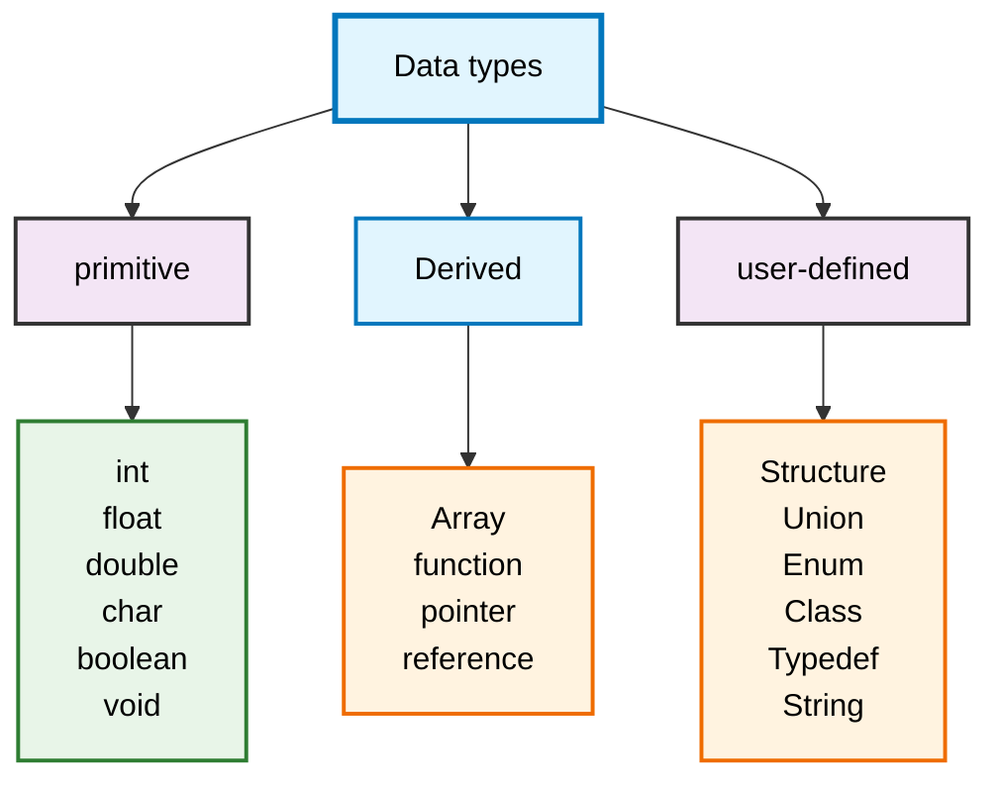

# C++ Guide

### Key Features Explained

- Platform dependent: C++ code needs to be compiled for specific platforms/architectures
- Object-oriented: Supports classes, objects, inheritance, polymorphism, and encapsulation
- Statically-typed: Variable types are checked at compile time
- Speed: Compiled language that produces efficient machine code
- Pointers: Direct memory access and manipulation capabilities
## #include -> Preprocessor directives
## How to use namespace
- Method 1
```cpp
#include <iostream>

using namespace std;

int main () {
  cout << "siddharth";
}
```
- Method 2
```cpp
#include <iostream>

int main () {
  std::cout << "siddharth" << std::endl;
}
```
- Method 3
```cpp
#include <iostream>

using std::cout;
using std::endl;

int main () {
  std::cout << "siddharth" << std::endl;
}
```
### Variable
```cpp
const int uuid = 756984;

uuid = 44587; // error; ❌
```
## C++ Data Types
##### This diagram shows the classification of data types in C++.


## strings in C++: 
```cpp
#include <iostream>
#include <string>

using namespace std;

int main()
{
    string sidd = "siddharth kumar rai";
    cout << sidd;
    
    return 0;
}
```
Code Explanation:

- #include <iostream> - Includes input/output stream library for cout
- #include <string> - Includes the string library to use std::string
- using namespace std; - Allows using standard library functions without std:: prefix
- string sidd = "siddharth kumar rai"; - Creates a string variable and initializes it
- cout << sidd; - Outputs the string to console
- return 0; - Indicates successful program execution

## C++ Operators
#### Operators are symbols that perform operations on variables and values. C++ has several types of operators:
1. Arithmetic Operators
Perform mathematical operations:
```cpp
int a = 10, b = 3;
int sum = a + b;        // Addition: 13
int diff = a - b;       // Subtraction: 7
int product = a * b;    // Multiplication: 30
int quotient = a / b;   // Division: 3
int remainder = a % b;  // Modulus: 1
```
2. Assignment Operators
Assign values to variables:
```cpp
int x = 5;      // Simple assignment
x += 3;         // Add and assign: x = x + 3 (8)
x -= 2;         // Subtract and assign: x = x - 2 (6)
x *= 2;         // Multiply and assign: x = x * 2 (12)
x /= 3;         // Divide and assign: x = x / 3 (4)
x %= 3;         // Modulus and assign: x = x % 3 (1)
```
3. Comparison Operators
Compare two values and return true/false:
```cpp
int a = 5, b = 10;
bool result1 = (a == b);    // Equal to: false
bool result2 = (a != b);    // Not equal to: true
bool result3 = (a < b);     // Less than: true
bool result4 = (a > b);     // Greater than: false
bool result5 = (a <= b);    // Less than or equal to: true
bool result6 = (a >= b);    // Greater than or equal to: false
```
4. Logical Operators
Combine boolean expressions:
```cpp
bool x = true, y = false;
bool result1 = x && y;      // AND: false
bool result2 = x || y;      // OR: true
bool result3 = !x;          // NOT: false
```
5. Increment/Decrement Operators
Increase or decrease values by 1:
```cpp
int num = 5;
num++;          // Post-increment: use value, then increment (num becomes 6)
++num;          // Pre-increment: increment, then use value (num becomes 7)
num--;          // Post-decrement: use value, then decrement (num becomes 6)
--num;          // Pre-decrement: decrement, then use value (num becomes 5)
```
6. Bitwise Operators
Operate on individual bits:
```cpp
int a = 5;      // Binary: 101
int b = 3;      // Binary: 011
int result1 = a & b;    // AND: 001 (1)
int result2 = a | b;    // OR: 111 (7)
int result3 = a ^ b;    // XOR: 110 (6)
int result4 = ~a;       // NOT: ...11111010 (-6)
int result5 = a << 1;   // Left shift: 1010 (10)
int result6 = a >> 1;   // Right shift: 10 (2)
```
7. Special Operators
```cpp
// Ternary operator (conditional)
int a = 5, b = 10;
int max = (a > b) ? a : b;      // If a > b, max = a, else max = b

// sizeof operator
int size = sizeof(int);         // Returns size of int in bytes

// Address-of and dereference operators
int var = 42;
int* ptr = &var;               // Address-of operator
int value = *ptr;              // Dereference operator
Operator Precedence (High to Low)
```
```cpp
() [] -> . - Postfix operators
++ -- + - ! ~ * & sizeof - Unary operators
* / % - Multiplicative
+ - - Additive
<< >> - Shift operators
< <= > >= - Relational
== != - Equality
& - Bitwise AND
^ - Bitwise XOR
| - Bitwise OR
&& - Logical AND
|| - Logical OR
?: - Ternary
= += -= *= /= %= - Assignment
```
 
